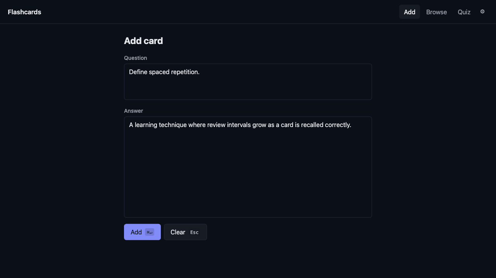
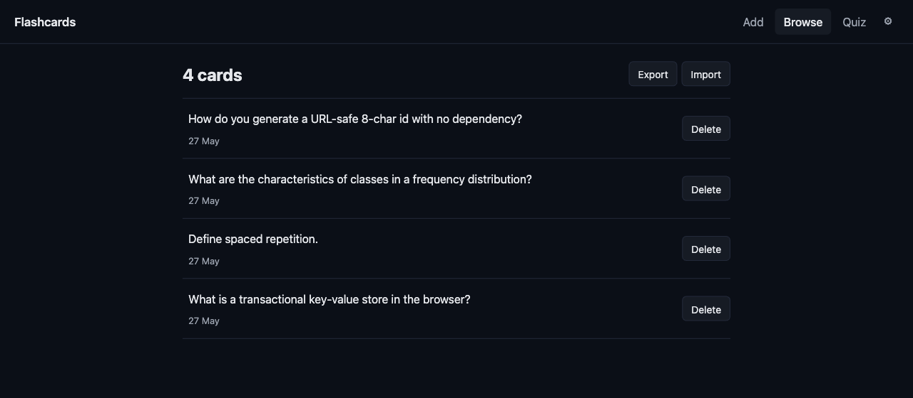
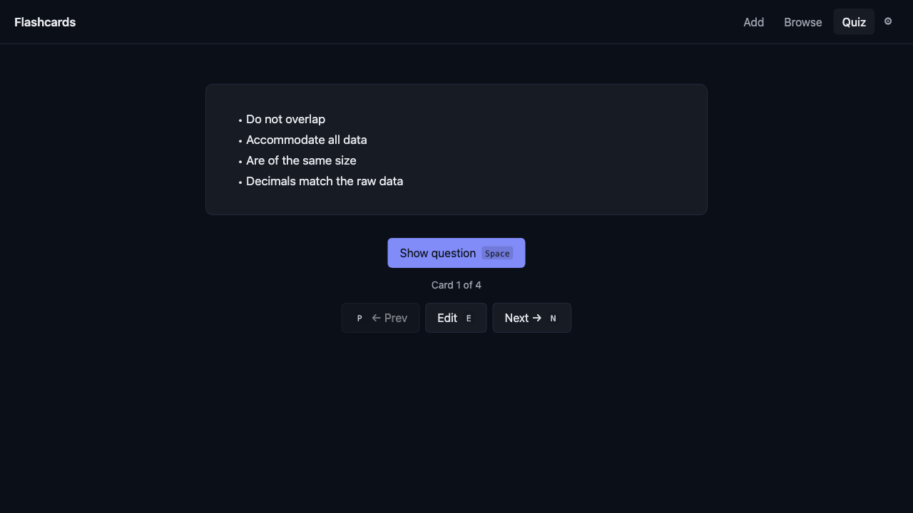

# Flashcards

A fast, fully client-side flashcard tool. No login, no server, no analytics. Cards live in your browser; export the whole library to JSON any time.

See [docs/plan.md](docs/plan.md) for the design doc and build phases.

## Screenshots

| Add | Browse | Quiz |
|---|---|---|
|  |  |  |

## Quick start

Requires Node 20+ and npm.

```bash
npm install
npm run dev
```

Opens at `http://localhost:5173` with hot module reload.

## Scripts

| Command | What it does |
|---|---|
| `npm run dev` | Vite dev server with HMR |
| `npm run build` | Production build → `dist/` |
| `npm run preview` | Serve the production build locally |
| `npm run check` | `svelte-check` (types + Svelte diagnostics) |

## Stack

[Vite](https://vite.dev) · [Svelte 5](https://svelte.dev) · TypeScript · IndexedDB (via [`idb-keyval`](https://github.com/jakearchibald/idb-keyval)) · [`marked`](https://marked.js.org) + [`DOMPurify`](https://github.com/cure53/DOMPurify) for markdown.

No CSS framework. No router library. No state-management library. The plan documents [why each one was rejected by default](docs/plan.md#4-tech-stack).

Bundle target: ≤ 50 KB gzipped.

## Project layout

```
src/
├── App.svelte          ← top-level layout + view switch
├── app.css             ← CSS tokens + base styles
├── main.ts             ← mount()
├── components/         ← shared UI (Header, etc.)
├── lib/                ← non-UI helpers (router, storage, markdown, …)
└── views/              ← one file per route (Add, Browse, Quiz)
```

## Routes

Hash-based, no server-side routing needed.

- `#/add` — capture a new card (default)
- `#/edit/:id` — edit an existing card (same component as Add)
- `#/browse` — list of all cards
- `#/quiz` — flip through a shuffled queue

## Keyboard

Press `?` anywhere in the app for the full shortcuts overlay. Nav is Gmail-style: `g a` / `g b` / `g q`. Quiz uses `Space` to flip, `n`/`p` (or `→`/`←`) to navigate, `e` to edit. Save in Add is `⌘/Ctrl + Enter`.

## Data

Cards live in IndexedDB. To wipe everything, open DevTools → Application → IndexedDB → `flashcards` → Delete database.

## License

Personal project. Take what's useful.
